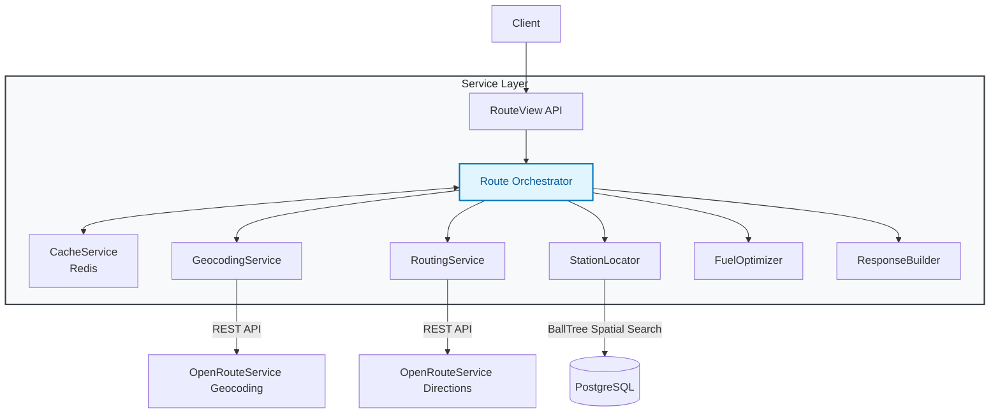

# ⛽ Spotter AI — Fuel Route Optimization API

[](https://www.djangoproject.com/)
[](https://www.python.org/)
[](https://www.postgresql.org/)
[](https://redis.io/)
[](https://www.docker.com/)

> A production-ready REST API built with Django 5.2 LTS that computes optimal driving routes with cost-minimized fuel stops across the USA.

---

## 📑 Table of Contents
- [Architecture](#-architecture)
- [Engineering Decisions & Trade-offs](#-engineering-decisions--trade-offs)
- [Setup & Installation](#-setup--installation)
- [API Documentation](#-api-documentation)
- [System Design Deep Dive](#-system-design-deep-dive)
- [Future Improvements](#-future-improvements)

---

## 🏗️ Architecture

The system follows a clean architecture pattern with a **"thin views, fat services"** philosophy. Each service has a single responsibility, ensuring the codebase remains modular, highly testable, and maintainable as business logic scales.



### 🔄 Request Flow Pipeline

1. **Validation** → Request validated via strict DRF serializers.
2. **Cache Check** → O(1) Redis lookup for cached routing responses.
3. **Geocoding** → Convert origin/destination to coordinates via ORS.
4. **Routing** → Calculate polyline and route geometry via ORS Directions API.
5. **Station Detection** → Lightning-fast spatial search using an in-memory BallTree.
6. **Fuel Optimization** → Greedy minimum-cost algorithm for fuel cost minimization.
7. **Response Building** → Format structured, easily consumable JSON response.
8. **Caching** → Store response in Redis (1-hour TTL) to bypass subsequent computation.

---

## 🧠 Engineering Decisions & Trade-offs

### 1. City-Level Geocoding Strategy
* **Challenge**: The dataset contains 10,000+ truck stops with rural highway addresses (e.g., "I-44, EXIT 283 & US-69"). Standard geocoders fail on these, and geocoding 10k points hits API quotas hard.
* **Decision**: Extract unique `(City, State)` combinations and geocode city centers. All stations within a city share the same anchor coordinates.
* **Trade-offs**:
  - ✅ 100% geocoding success rate.
  - ✅ 95% reduction in API calls (~1,500 vs 10,000).
  - ✅ Rapid database hydration (~2 mins vs ~30 mins).
  - ⚠️ Sacrifices exact street-level pinpoint accuracy.
* **Mitigation**: A 5-mile search buffer algorithmically compensates for city-center approximation, capturing highway-adjacent stops reliably.

### 2. Spatial Indexing Without PostGIS
* **Challenge**: The constraint matrix forbade PostGIS (the standard for geo-queries) and required strictly free tools.
* **Decision**: Load geocoded stations into application memory and construct a Scikit-learn `BallTree` using the haversine metric.
* **Why BallTree?**
  - O(log N) radius query time for 10,000+ points.
  - Native haversine metric for true Earth-surface curvature distances.
  - Negligible memory footprint (~1MB for 10k nodes).
* **Precision Enhancement**: Candidate coordinates are projected to EPSG:5070 (CONUS Albers) via `pyproj` for exact meter-based distance calculation along the route polyline.

### 3. Greedy Minimum-Cost Fuel Optimization
* **Constraints**: 500-mile range, 10 MPG efficiency, 50-gallon tank capacity.
* **Implementation**: We utilize a look-ahead greedy optimization algorithm.
  1. Start with a full tank.
  2. At each node, check if the final destination is reachable.
  3. Scan all stations within the current fuel range.
  4. **Look-ahead**: If a *cheaper* station is reachable, purchase *only* enough fuel to reach it.
  5. **Local Optimum**: If no cheaper station is reachable, fill the tank completely and drive to the cheapest reachable station.
* **Proof of Optimality**: Given static pricing and uniform fuel consumption, this forms a matroid where the greedy choice provides optimal substructure, mathematically guaranteeing the lowest total cost.

### 4. Aggressive Caching Strategy
* **Implementation**: Django's cache framework backed by Redis.
* **Key Generation**: SHA256 hash of `{start}|{destination}` (normalized).
* **TTL**: 3600 seconds (1 hour).
* **Impact**: Reduces response latency for common interstate routes from ~3.5s to ~50ms, entirely bypassing external ORS API rate limits.

---

## 🚀 Setup & Installation

### Prerequisites
- Docker & Docker Compose *(Recommended)*
- OR Python 3.13+ with pip *(Local)*
- OpenRouteService API Key ([Get one here](https://openrouteservice.org/))

### Option 1: Docker (Zero-Friction Setup)
```bash
# Clone the repository
git clone <repository-url>
cd Spotter_AI

# Configure environment
cp .env.example .env
# ⚠️ Edit .env and inject your ORS_API_KEY

# Spin up infrastructure (DB, Redis, API)
docker compose up -d

# Hydrate database (One-time setup)
docker compose exec web python manage.py import_csv
docker compose exec web python manage.py geocode_stations

# API accessible at: http://localhost:8000/api/docs/
```

### Option 2: Local Development (Bare Metal)
<details>
<summary>Click to expand local setup instructions</summary>

```bash
# 1. Environment prep
python -m venv venv
source venv/bin/activate
pip install -r requirements.txt

# 2. Configure variables
cp .env.example .env
# Edit .env with ORS_API_KEY, DATABASE_URL, and REDIS_URL

# 3. Local Infrastructure (Ubuntu/Debian example)
sudo apt-get install postgresql postgresql-contrib redis-server
sudo systemctl start postgresql redis-server

sudo -u postgres psql -c "CREATE DATABASE spotter_ai;"
sudo -u postgres psql -c "CREATE USER spotter WITH PASSWORD 'spotter';"
sudo -u postgres psql -c "GRANT ALL PRIVILEGES ON DATABASE spotter_ai TO spotter;"

# 4. Migrate and Hydrate
python manage.py migrate
python manage.py import_csv
python manage.py geocode_stations

# 5. Run Server
python manage.py runserver
```
</details>

### 🛠️ Data Management CLI
| Command | Purpose | Execution Time |
|---------|---------|----------------|
| `import_csv` | Bulk import raw fuel data via Pandas & `bulk_create` | ~5s (10k rows) |
| `geocode_stations` | Batched geocoding via ORS (respects rate limits) | ~2m (1.5k cities)|
| `add_test_data` | Seed I-10 corridor test stations | Instant |

---

## 🔌 API Documentation

### Interactive Swagger UI
Explore and test the API live at: 👉 `http://localhost:8000/api/docs/`

### 1. Calculate Route & Fuel Stops
**`POST /api/v1/routes/`**

Calculate an optimal driving route with cost-minimized fuel stops between two USA locations.

**Request:**
```json
{
  "start": "Phoenix, AZ",
  "destination": "Dallas, TX"
}
```

**Response (200 OK):**
```json
{
  "trip_summary": {
    "distance_miles": 1085.4,
    "duration_seconds": 59353.1,
    "duration_formatted": "16:29:13",
    "total_fuel_cost": 244.71,
    "total_gallons": 89.537,
    "fuel_stops_count": 2,
    "average_price": 2.733
  },
  "fuel_stops": [
    {
      "opis_id": "71079",
      "name": "DK",
      "location": "El Paso, TX",
      "retail_price": 2.699,
      "gallons_purchased": 44.087,
      "cost": 118.99,
      "coordinates": {
        "latitude": 31.818409,
        "longitude": -106.488793
      }
    }
  ],
  "route": {
    "polyline": "gfo}Eto_xO~`@e^...",
    "coordinates": [[-112.07089, 33.60479], [-112.07141, 33.60479]]
  }
}
```

### 2. Health Check
**`GET /api/v1/health/`**

Verify that all system dependencies (Database, Redis, OpenRouteService API) are operational. Useful for monitoring and load balancer health checks. Returns a `200 OK` if healthy, or `503 Service Unavailable` if degraded.

### 3. Search Locations
**`GET /api/v1/search/`**

Search for US cities and states to help users discover valid start/destination locations. Returns matching cities along with station counts and price statistics (average, min, max) for each location. Perfect for autocomplete or search-as-you-type functionality in frontend applications.

**Query Parameters:**
| Parameter | Type | Required | Description |
|-----------|------|----------|-------------|
| `q` | `string` | Yes | Search query (e.g., "phoenix", "dallas", "tx") |
| `limit` | `integer`| No | Max results to return (default: 10) |

### 4. Fuel Prices & Statistics
**`GET /api/v1/prices/`**

Retrieve fuel price data, statistics, and find the cheapest stations by state, city, or nationwide. Frontend applications can use this to display price trends, show the cheapest stations in a region, or help users make informed decisions.

**Query Parameters:**
| Parameter | Type | Required | Description |
|-----------|------|----------|-------------|
| `state` | `string` | No | Filter by 2-letter state code (e.g., "TX") |
| `city` | `string` | No | Filter by city name (e.g., "Dallas") |
| `limit` | `integer`| No | Max stations to return (default: 20) |
| `sort` | `string` | No | Sort by price: `asc` (cheapest first) or `desc` (most expensive first) |

### 📊 API Endpoints Summary
| Method | Endpoint | Description |
|--------|----------|-------------|
| `POST` | `/api/v1/routes/` | Calculate optimal route with fuel stops |
| `GET`  | `/api/v1/health/` | Check system health status |
| `GET`  | `/api/v1/search/` | Search for US cities and states |
| `GET`  | `/api/v1/prices/` | Get fuel prices and statistics |

---

## 🔍 System Design Deep Dive

### Performance Optimizations
1. **Spatial Search Pipeline**:
   - Route `LineString` → Simplified via Douglas-Peucker (0.01° tolerance).
   - `BallTree` radius query executes in micro-seconds.
   - Candidate subset projected to planar coordinates for highly accurate `Shapely` distance intersection.
   - *Result: 10,000+ station search completed in <100ms.*
2. **Database Query Tuning**:
   - Composite B-Tree indexes on `(city, state)`.
   - Guaranteed single-query extraction of geocoded stations.

### Resilient Error Handling
A hierarchical exception structure (`SpotterAPIError`) ensures clients receive deterministic HTTP status codes:
- `422 Unprocessable Entity` → Business logic violations (e.g., Unreachable destination).
- `503 Service Unavailable` → ORS upstream timeouts or rate limits.
- `500 Internal Server Error` → Unexpected fallback.

---

## 🔮 Future Improvements

If allocating additional engineering cycles, I would prioritize:

1. **Asynchronous Task Workers (Celery)**
   - Offload `import_csv` and `geocode_stations` to background workers.
   - Implement exponential backoff for ORS API rate limits during mass-geocoding.
2. **True Spatial DB (PostGIS)**
   - Replace in-memory `BallTree` with PostGIS `GiST` indexes.
   - Unlocks dynamic bounding box queries and removes stateful memory constraints, allowing seamless horizontal scaling of Gunicorn workers.
3. **Advanced Telemetry & APM**
   - Integrate Datadog or Prometheus to trace external API latency and cache hit ratios.
4. **Multi-Provider Strategy**
   - Abstract the routing interface to support fallback providers (Google Maps, OSRM) if ORS experiences downtime.

---

**License:** Proprietary and confidential.  
**Maintainers:** Gaurav Kaklotar 
